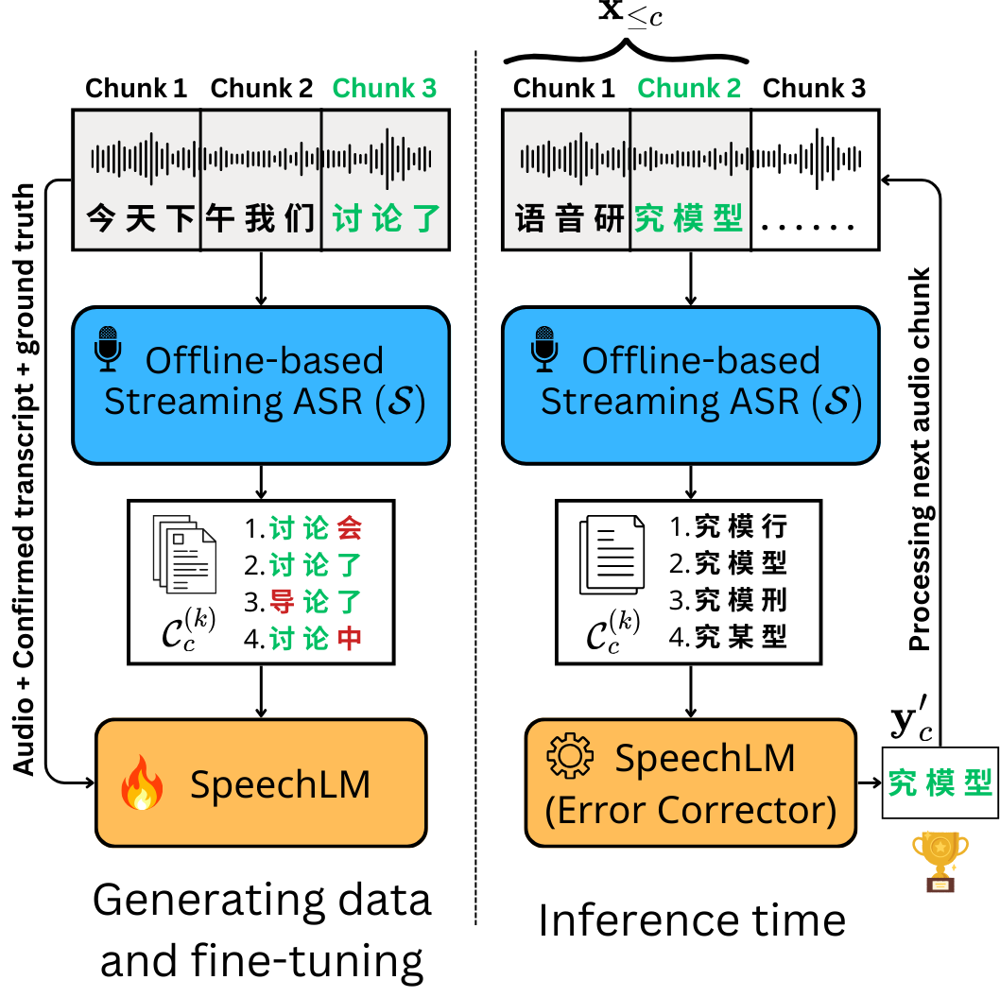

<div align="center">
  <h1 style="margin-bottom:0.4em">StreamCorrect: Bringing Offline ASR Performance to Streaming via Error Correction</h1>
  
</div>

## About StreamCorrect
StreamCorrect addresses the challenges of streaming ASR, where error propagation and limited context often degrade performance compared to offline models. It introduces a lightweight error corrector fine-tuned on self-generated data to mitigate accumulated errors in real-time. This approach bridges the gap between offline ASR quality and streaming requirements, preserving pretrained model performance without requiring distillation into streaming-style architectures.

## Demo

| 100ms | 500ms | 1000ms |
|:-----:|:-----:|:------:|
| <video src="https://github.com/user-attachments/assets/3a4a2947-5881-4b93-b7b6-f233ee44523b" width="125"></video> | <video src="https://github.com/user-attachments/assets/d2b20305-c569-4268-b7e2-fd2230b0b610" width="125"></video> | <video src="https://github.com/user-attachments/assets/7b25abc1-a369-4b8d-a5a7-b907c7bc106f" width="125"></video> |
| <video src="https://github.com/user-attachments/assets/db04237f-5945-4bbe-b478-ad0ea33e1222" width="125"></video> | <video src="https://github.com/user-attachments/assets/49da677d-5ebf-4602-b5a7-8b952744815a" width="125"></video> | <video src="https://github.com/user-attachments/assets/9fef09a3-5703-4ed5-b1ae-afbfd5311259" width="125"></video> |
| <video src="https://github.com/user-attachments/assets/f3503255-3cfe-4e38-9933-48b24393b76c" width="125"></video> | <video src="https://github.com/user-attachments/assets/805e8074-91f1-425b-96b9-5898bbf3cf4d" width="125"></video> | <video src="https://github.com/user-attachments/assets/750636de-5152-4491-b53f-ceac50910c4e" width="125"></video> |
| <video src="https://github.com/user-attachments/assets/ed53345b-5fc4-456d-8c1c-d5eac0ba1418" width="125"></video> | <video src="https://github.com/user-attachments/assets/d767ba22-85b1-427c-b132-c03c298c0b56" width="125"></video> | <video src="https://github.com/user-attachments/assets/c2e1d03d-4394-49dd-871f-c8fa433829be" width="125"></video> |

## Preparation
### Install packages

```bash
conda create -n StreamCorrect python=3.10
conda activate StreamCorrect
pip install -r requirements.txt
```

### Model checkpoints
Offline ASR models and Error Correction model could be downloaded [here](https://drive.google.com/drive/folders/1h2tOl6gs93SYZo7fTsc1JYmsOyyRZFLf?usp=sharing)

### Data preparation
Download WSYue-ASR-eval for testing:
```bash
git clone https://huggingface.co/datasets/ASLP-lab/WSYue-ASR-eval 
tar -xzf WSYue-ASR-eval/Short/wav.tar.gz
```
Preprocess the data:
```bash
python wsyue_asr_eval.py \
        --input ./WSYue-ASR-eval/Short/content.txt \
        --output ./WSYue-ASR-eval/Short/content.json \
        --audio-dir ./WSYue-ASR-eval/Short/wav_ \
```

### Install model checkpoint
Download `whisper-medium-yue` checkpoint:
```bash
git clone https://huggingface.co/ASLP-lab/WSYue-ASR
mv WSYue-ASR/whisper_medium_yue/whisper_medium_yue.pt ./
rm -rf WSYue-ASR
```

## Inference

- Inference of SimulStreaming with Error Corrector on a single `.wav` file
```bash
bash runs/run_single_eval_aishell.sh
```

- Inference of SimulStreaming with Error Corrector on a folder of `.wav` files
```bash
bash runs/run_batch_eval_aishell.sh
```

- Output file will be saved to `save_dir/streaming_medium-yue_wsyue_results/evaluation_results.json` with format similar to the follows:
```json
{
  "total_files": 14120,
  "matched_files": 100,
  "unmatched_files": 14020,
  "average_cer": 0.2171288845095628,
  "average_mer": 0.2413379123456789,
  "per_file_results": [
    {
      "file": "0000004453.wav",
      "reference": "美国都已经系另外一件事呃欧洲国家亦都系另外一个回事",
      "generated": "都已经 系另外一件事 欧洲国家 亦都系另外一护",
      "cer": 0.24,
      "mer": 0.26,
      "ref_length": 25,
      "gen_length": 23,
      "first_token_latency_ms": 1312.2074604034424
    },
    {
      "file": "0000009941.wav",
      "reference": "咁我哋就改咗个心出嚟啦即系硬呢度啦吓",
      "generated": "咁我 哋就改咗个心 出嚟啦即系 硬呢度啦",
      "cer": 0.05555555555555555,
      "mer": 0.08333333333333333,
      "ref_length": 18,
      "gen_length": 20,
      "first_token_latency_ms": 1300.1341819763184
    }
  ],
  "average_first_token_latency_ms": 1731.2631171236756
}
```

## Acknownledgement
This code was adapted and modified from `SimulStreaming` project
```
@inproceedings{simulstreaming,
    title = "Simultaneous Translation with Offline Speech and {LLM} Models in {CUNI} Submission to {IWSLT} 2025",
    author = "Mach{\'a}{\v{c}}ek, Dominik  and
      Pol{\'a}k, Peter",
    editor = "Salesky, Elizabeth  and
      Federico, Marcello  and
      Anastasopoulos, Antonis",
    booktitle = "Proceedings of the 22nd International Conference on Spoken Language Translation (IWSLT 2025)",
    month = jul,
    year = "2025",
    address = "Vienna, Austria (in-person and online)",
    publisher = "Association for Computational Linguistics",
    url = "https://aclanthology.org/2025.iwslt-1.41/",
    doi = "10.18653/v1/2025.iwslt-1.41",
    pages = "389--398",
    ISBN = "979-8-89176-272-5"
}
```
